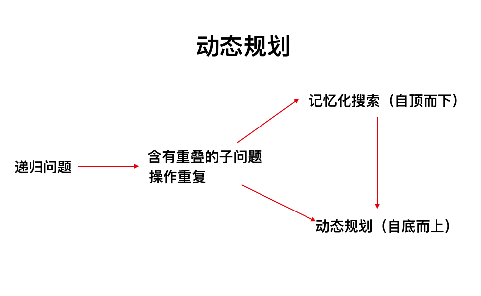

# 题目解法分类

通过解法分类，更容易把握某一类题的解法，也能加深对某个种类解法的理解（换句话说，对该类解法能解决什么问题，有什么利弊能有一个把握）。

## 数组、链表

### 二分法/分治法

[23. 合并K个升序链表|解法3](src/main/java/net/teaho/algorhythm/leetcode/alg023mergeKLists/Solution3.java)  
[148. 排序链表](src/main/java/net/teaho/algorhythm/leetcode/alg148/Solution.java),用到[归并排序|teaho.net](https://java-api-learning.gitbook.teaho.net/book/algorithm/merge_sort.html)

### 二分查找

查找有一定的内在规律的元素集中某个特定元素的题目，可以考虑二分查找加快速度。

[34. 在排序数组中查找元素的第一个和最后一个位置](src/main/java/net/teaho/algorhythm/leetcode/alg034/Solution.java)  
[162. 寻找峰值](src/main/java/net/teaho/algorhythm/leetcode/alg162/Solution.java)

### 快慢指针

[234. 回文链表](src/main/java/net/teaho/algorhythm/leetcode/alg234/Solution.java)

### 快排

[75. 颜色分类](src/main/java/net/teaho/algorhythm/leetcode/alg075/Solution.java)

## Hash（哈希表）

[1. 两数之和](src/main/java/net/teaho/algorhythm/leetcode/alg001twoSum/Solution.java)  
[49. 字母异位词分组](src/main/java/net/teaho/algorhythm/leetcode/alg049/Solution.java)  
[128. 最长连续序列](src/main/java/net/teaho/algorhythm/leetcode/alg128/Solution.java)  

## 栈

[20. 有效的括号](src/main/java/net/teaho/algorhythm/leetcode/alg020validParentheses/Solution.java)  
[32. 最长有效括号](src/main/java/net/teaho/algorhythm/leetcode/alg032longestValidParentheses/Solution2.java)  

### 单调栈

[84. 柱状图中最大的矩形](src/main/java/net/teaho/algorhythm/leetcode/alg084/Solution.java)  
[739. 每日温度](src/main/java/net/teaho/algorhythm/leetcode/alg739/Solution.java)  

## 队列

### 单调队列

[239. 滑动窗口最大值](src/main/java/net/teaho/algorhythm/leetcode/alg239/Solution.java)

### 优先队列

小根堆：
[253. 会议室 II](src/main/java/net/teaho/algorhythm/leetcode/alg253/Solution.java)

## 树

### 遍历

[94. 二叉树的中序遍历](src/main/java/net/teaho/algorhythm/leetcode/alg094/Solution.java)  
[98. 验证二叉搜索树](src/main/java/net/teaho/algorhythm/leetcode/alg098/Solution.java)  
[104. 二叉树的最大深度](src/main/java/net/teaho/algorhythm/leetcode/alg104/Solution.java)

递归遍历：  
[226. 翻转二叉树](src/main/java/net/teaho/algorhythm/leetcode/alg226/Solution.java)

### Trie树

[208. 实现 Trie (前缀树)](src/main/java/net/teaho/algorhythm/leetcode/alg208/Trie.java)

[数据结构与算法：字典树（前缀树）](https://zhuanlan.zhihu.com/p/28891541)

## 广度优先和深度优先

广度优先搜索（BFS）和深度优先搜索（DFS）是通用的图遍历算法。

### 深度优先遍历

[22. 括号生成|解法一](src/main/java/net/teaho/algorhythm/leetcode/alg022/Solution.java)

### 回溯（深度优先搜索）

对于这类寻找所有可行解的题，我们都可以尝试用「搜索回溯」的方法来解决。  

[回溯法|维基百科](https://zh.wikipedia.org/zh-hans/%E5%9B%9E%E6%BA%AF%E6%B3%95)  

[39. 组合总和](src/main/java/net/teaho/algorhythm/leetcode/alg039combinationSum/Solution.java)  
[78. 子集](src/main/java/net/teaho/algorhythm/leetcode/alg078/Solution.java)  
[79. 单词搜索](src/main/java/net/teaho/algorhythm/leetcode/alg079/Solution.java)  
[494. 目标和](src/main/java/net/teaho/algorhythm/leetcode/alg494/Solution.java)  

### 广度优先搜索

[301. 删除无效的括号](src/main/java/net/teaho/algorhythm/leetcode/alg301/Solution1.java)

## 动态规划

[53. 最大子序和](src/main/java/net/teaho/algorhythm/leetcode/alg053/Solution.java)  
[62. 不同路径|解法二](src/main/java/net/teaho/algorhythm/leetcode/alg062/Solution2.java)  
[64. 最小路径和](src/main/java/net/teaho/algorhythm/leetcode/alg064minimumPathSum/Solution.java)  
[72. 编辑距离](src/main/java/net/teaho/algorhythm/leetcode/alg072/Solution.java)  
[96. 不同的二叉搜索树](src/main/java/net/teaho/algorhythm/leetcode/alg096/Solution.java)  
[139. 单词拆分](src/main/java/net/teaho/algorhythm/leetcode/alg139/Solution.java)  
[198. 打家劫舍](src/main/java/net/teaho/algorhythm/leetcode/alg198houseRobber/Solution.java)  
[221. 最大正方形](src/main/java/net/teaho/algorhythm/leetcode/alg221maximalSquare/Solution.java)  
[279. 完全平方数](src/main/java/net/teaho/algorhythm/leetcode/alg279/Solution.java)
[309. 最佳买卖股票时机含冷冻期](src/main/java/net/teaho/algorhythm/leetcode/alg309/Solution.java)
[322. 零钱兑换](src/main/java/net/teaho/algorhythm/leetcode/alg322/Solution.java)

## Floyd判圈算法

[141. 环形链表](src/main/java/net/teaho/algorhythm/leetcode/alg141/Solution.java)  
[142. 环形链表 II](src/main/java/net/teaho/algorhythm/leetcode/alg142/Solution.java)  
[287. 寻找重复数](src/main/java/net/teaho/algorhythm/leetcode/alg287/Solution.java)  
 
## 贪心算法

定义：[贪心算法|wikipedia](https://zh.wikipedia.org/wiki/%E8%B4%AA%E5%BF%83%E7%AE%97%E6%B3%95)  

[55. 跳跃游戏](src/main/java/net/teaho/algorhythm/leetcode/alg55jumpGame/Solution.java)  

## 合并区间类型题目

该类题目并没涉及什么算法，重点是想清楚区间合并思路。
[秒懂力扣区间题目：重叠区间、合并区间、插入区间|甜姨的奇妙冒险](https://mp.weixin.qq.com/s/ioUlNa4ZToCrun3qb4y4Ow)

[56. 合并区间](src/main/java/net/teaho/algorhythm/leetcode/alg56mergeIntervals/Solution.java)  

## 排列组合

[62. 不同路径|解法一](src/main/java/net/teaho/algorhythm/leetcode/alg062/Solution1.java)

## 滑动窗口

[76. 最小覆盖子串](src/main/java/net/teaho/algorhythm/leetcode/alg076/Solution.java)  

## 卡特兰数公式

[96. 不同的二叉搜索树](src/main/java/net/teaho/algorhythm/leetcode/alg096/Solution.java)  

## 图

广度优先遍历：  
[207. 课程表](src/main/java/net/teaho/algorhythm/leetcode/alg207/Solution.java)  

 
## 中心拓展

[647. 回文子串](cpp/alg647/main.cpp)  

## 位计数功能

[461. 汉明距离](src/main/java/net/teaho/algorhythm/leetcode/alg461/Solution.java)

## 参考别人题单

分类题单
如何科学刷题？

* 滑动窗口与双指针（定长/不定长/单序列/双序列/三指针/分组循环）
* 二分算法（二分答案/最小化最大值/最大化最小值/第K小）
* 单调栈（基础/矩形面积/贡献法/最小字典序）
* 网格图（DFS/BFS/综合应用）
* 位运算（基础/性质/拆位/试填/恒等式/思维）
* 图论算法（DFS/BFS/拓扑排序/最短路/最小生成树/二分图/基环树/欧拉路径）
* 动态规划（入门/背包/状态机/划分/区间/状压/数位/数据结构优化/树形/博弈/概率期望）
* 常用数据结构（前缀和/差分/栈/队列/堆/字典树/并查集/树状数组/线段树）
* 数学算法（数论/组合/概率期望/博弈/计算几何/随机算法）
* 贪心与思维（基本贪心策略/反悔/区间/字典序/数学/思维/脑筋急转弯/构造）
* 链表、二叉树与回溯（前后指针/快慢指针/DFS/BFS/直径/LCA/一般树）
* 字符串（KMP/Z函数/Manacher/字符串哈希/AC自动机/后缀数组/子序列自动机）

作者：灵茶山艾府
链接：https://leetcode.cn/problems/target-sum/solutions/2119041/jiao-ni-yi-bu-bu-si-kao-dong-tai-gui-hua-s1cx/